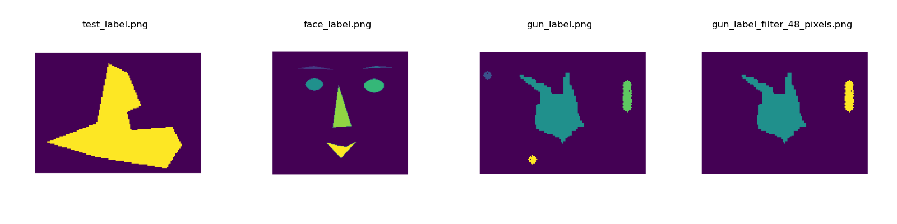

# MP1
## 1. Overview
In the `main.py`, I process a binary image by converting it from a bool image (0/1) to an 8-bit image and then mask each connected compnent with different label.

## 2. Main CCL Algorithm
For the `ccl(image_array:np.ndarray, size_filter:int)` function, I am not using a recursive solution due to potential issues when dealing with large images that could result in an **excessive recursive depth**. Also, I'm not employing the sequential (two-pass) solution because **I only want to scan once**.

Inspired by the BFS/DFS path planning algorithm, a recursive solution may consume too much memory as the recursion depth increases. A feasible alternative is to use a **while loop** coupled with a **queue** to iterate through the connected pixels. This iterative method provides complete control over the process and ensures that memory usage remains stable regardless of the size of the connected component.

In the algorithm, the image is scanned pixel-by-pixel. Upon encountering an unvisited foreground pixel, a new component group is initiated. Its neighbors, determined via a boundary function, are examined, and any unvisited foreground pixels are added to a processing queue. The queue is processed iteratively with a while loop, flooding the connected region. After traversing the region, a size filter discards groups that are too small, and each retained group's pixels receive a unique label—all achieved in a single scan of the image.

## 3. Results

As shown in the 8-bit images, the algorithm correctly classifies and masks different components with different labels. Also, the `size_filter` with 48 pixels threshold is working for the last image.