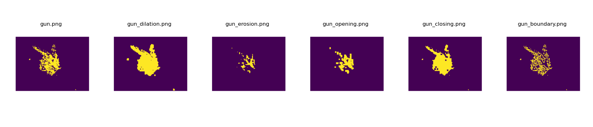
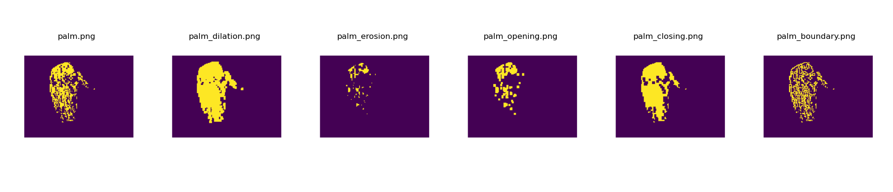

# MP2
## 1. Overview
In `main.py`, I implement basic binary morphological operations—erosion, dilation, opening, closing—and boundary extraction on a binary image. The script:

- Loads an image
- Applies each morphology function with a user‑specified square structuring element (SE)
- Displays the original and processed images for visual inspection

## 2. Morphological Operations Implementation
All functions take a 2D NumPy array `img` (values 0 or 1) and an integer `ksize` (SE size) and return a new binary image. The SE is a square of ones of size `ksize×ksize` centered at each pixel.

- **`erosion(img, ksize)`**  
  For each pixel, center the `ksize×ksize` window on the input image. The output pixel is set to 1 only if **every** position under the window corresponds to a foreground (1) pixel in the input. If any position in the window lies outside the image bounds or over a background (0), erosion fails and the output is 0. This effectively shrinks objects and removes small, isolated foreground regions.

- **`dilation(img, ksize)`**  
  For each pixel, center the same-size window on the input. The output pixel is set to 1 if **at least one** position under the window maps to a foreground pixel in the input. Positions outside the input are ignored. Dilation expands object boundaries and connects nearby foreground regions.

- **`opening(img, ksize)`**  
  First applies erosion to remove small artifacts and narrow protrusions, then applies dilation to restore the shape of larger objects. This two-step process smooths contours, breaks narrow connections, and eliminates tiny foreground specks.

- **`closing(img, ksize)`**  
  First applies dilation to fill small holes and connect close regions, then applies erosion to restore original object sizes. The result smooths object contours, closes gaps, and removes small background interruptions within objects.

- **`boundary(img, ksize)`**  
  Computes the boundary by subtracting the eroded image from the original: `boundary = img - erosion(img)`. Pixels that vanish under erosion (where original is 1 but eroded is 0) are marked as boundary. This highlights the contour at object edges.

## 3. Results

The outputs clearly demonstrate how each operation affects shape size, connectivity, and edge definition in the binary gun and palm image.
