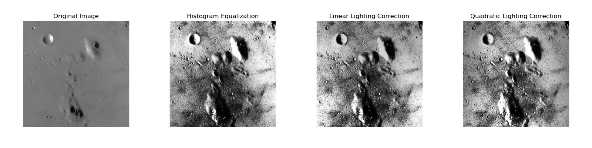
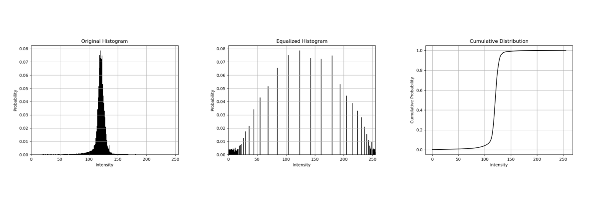

# MP3

## 1. Overview
In `main.py` I implement **global histogram equalization** and **lighting correction** by estimating a low-order illumination surface (linear plane and quadratic surface) and removing it via multiplicative normalization.

## 2. Algorithm Description
- **Histogram Equalization**  
  1. Count pixel intensities (0–255) into `hist`  
  2. Normalize to probability distribution (PD)  
  3. Build cumulative distribution (CD)  
  4. Create lookup table:  
     ```  
     mapping[r] = round(255 × CD[r])  
     ```  
  5. Remap every pixel via nested loops  
  6. Recompute PD of equalized image for verification  

- **Lighting Correction**  
  1. Generate normalized coordinate grids `X, Y` $\in$ `[0,1]`
  2. **Linear model**: fit by least-squares  
     $$
     I_{illum}(x,y) = a\times x + b\times y + c  
     $$
     
  3. **Quadratic model**: fit by least-squares  
     $$
     I_{illum}(x,y) = a\times x^2 + b\times y^2 + c\times x\times y + d\times x + e\times y + f  
     $$
  4. Compute mean illumination $\hat{I}$ and $I_{correction}$ with
     $$
     I_{correction}(x,y) = I_{hist\_eq}(x,y) × (\frac{\hat{I}}{I_{illum}(x,y)})
     $$

## 3. Results



The top row displays the image after histogram equalization, linear lighting correction, and quadratic lighting correction.

The bottom row shows the original histogram, the equalized histogram, and the transfer function $T(r)$ used to remap the original intensities.
