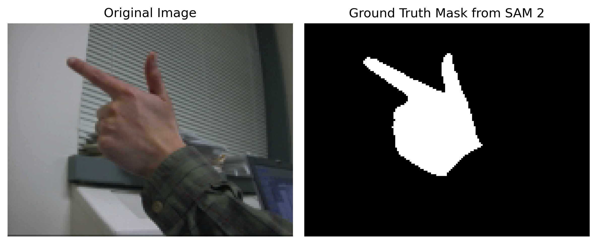
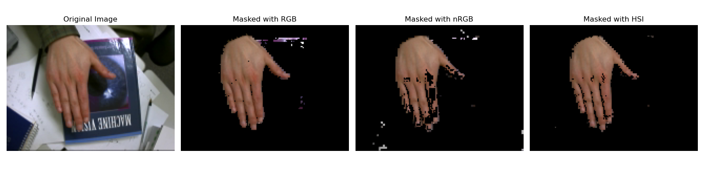
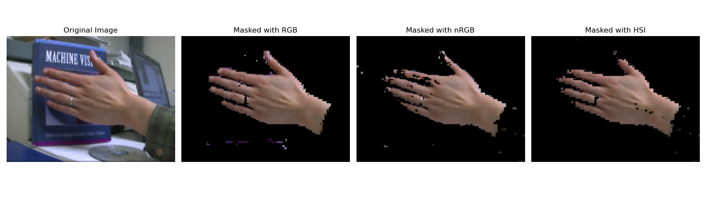

# MP4

## 1. Overview
In `main.py`, I implement:

- Computation of 2D color histograms in different color spaces (RGB, nRGB, HSI) over masked image regions.
- Visualization of the resulting histogram as a grayscale images.
- Segmentation of images using the computed 2D histograms by thresholding the color probability.

For generating training data, I used [Segment Anything Model 2 (SAM 2)](https://github.com/facebookresearch/sam2) to generate masks as **ground truth**:

## 2. Algorithm Description

- **2D Histogram Computation**  
  1. Traverse each `*rgb.png` and its corresponding `*mask.png` in the dataset directory.  
  2. Load the image in the chosen color space (`rgb`, `nrgb`, or `hsi`).  
  3. Apply the binary mask to select valid pixels.  
  4. Accumulate counts for each channel pair (R,G) into a 256×256 histogram array with `np.add.at`.  
  5. Normalize counts by the total number of masked pixels to obtain a probability distribution.

- **Normalization**  
  - **Non-zero scaling**: scale only non-zero histogram bins so that the maximum becomes 1.

- **Visualization**  
  1. Normalize histogram values to [0..1] or directly use probabilities.  
  2. Multiply by 255 and convert to `uint8` to form a grayscale image.  
  3. Display using PIL’s `Image.show()`.

- **Segmentation**  
  1. For a test image, look up each pixel’s (r,g) probability from the histogram.  
  2. Optionally normalize the histogram’s non-zero values.  
  3. Apply a probability threshold to generate a binary mask (0 or 255).  
  4. Mask the original RGB image for visualization.

## 3. Results
### 2D Histograms
I’m displaying the rescaled R–G, nR–nG, and H–S 2D histograms as 256×256 grayscale images, where each pixel’s intensity encodes its probability (0–1).

### Masked Results
As illustrated below, I’ve applied various 2D-histogram thresholds to segment the hands in each image, and a quick glance shows the HSI-based method produces the most accurate masks.

