# MP5

## 1. Overview

In `main.py` I implement a full Canny edge detector pipeline from scratch in pure NumPy:

- **Gaussian smoothing** with a user-defined kernel size N*N and standard deviation sigma.  
- **Gradient computation** [G_x, G_y]: magnitude=sqrt(G_x^2 + G_y^2) and arctan() for theta.  
- **Automatic threshold selection**: histogram of the gradient magnitudes to CDF for picking T_high so that a given fraction of pixels are below it, and T_low=0.5*T_high.  
- **Non-maximum suppression** to thin edges, using either 4-way quantization or interpolation along the gradient.  
- **Hysteresis thresholding & edge linking**: start from strong edges >= T_high and recursively follow any weak neighbors >= T_low.  
- **Parameter sweeps** over `N`, `sigma`, and `percentage_non_edge` to see how they affect final edge quality.

I test on four images (`lena.bmp`, `test1.bmp`, `pointer1.bmp`, `joy1.bmp`) and compared edge detection results with **OpenCV**.

## 2. Algorithm Description

1. **Gaussian smoothing**  
   - Build an N*N Gaussian kernel.
   - Convolve it with the image (edge-pad) per channel.

2. **Gradient computation**  
   - Convert RGB to Grayscale.
   - Compute gradients along X and Y and convert to magnitude and theta.

3. **Threshold selection**  
   - Flatten gradient magnitude into a histogram.  
   - Choose T_high at the bin where CDF is greater equal than `percentage_non_edge` and set T_low = 0.5*T_high

4. **Non-maximum suppression**  
   - For each pixel, compare its magnitude to the two neighbors along the gradient direction: pick one of 4 directions (0°,45°,90°,135°) based on [Gx, Gy] and signs.  

5. **Hysteresis & edge linking**  
   - Build boolean masks  
   - `mag_low = mag_sup >= t_low`, `mag_high = mag_sup >= t_high`
   - For each unvisited strong pixel, do a stack-based flood fill over 8-neighbors in `mag_low`, marking all reached as final edges.

6. **Parameter experiments**  
   - Sweep three sets of parameter triples `N`, `sigma`, `percentage_non_edge` and plot the resulting edge maps side-by-side for each test image.

## 3. Results
Below are resultsabout gaussian smoothing, gradient magnitudes, NMS and final edge maps. Results are showing all functions are working correctly.
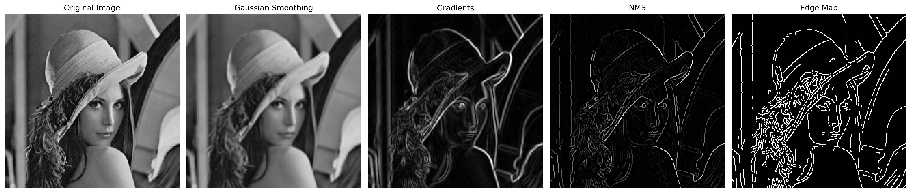
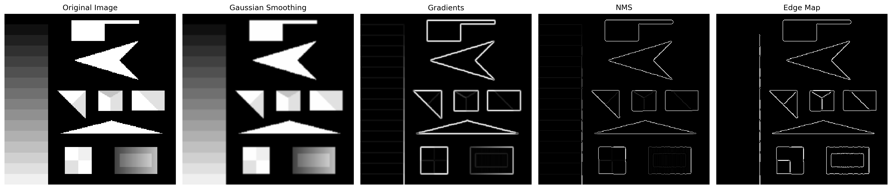
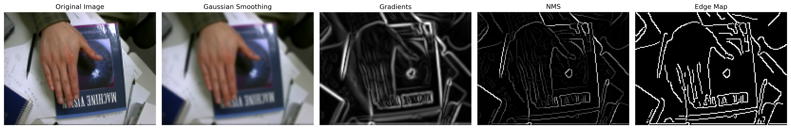
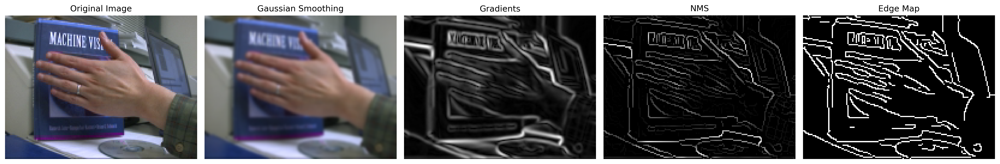

## 3. Comparison
I compared the edge detection results with `cv2` functions. I found they're basically the same.
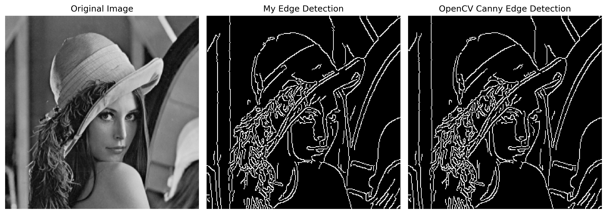
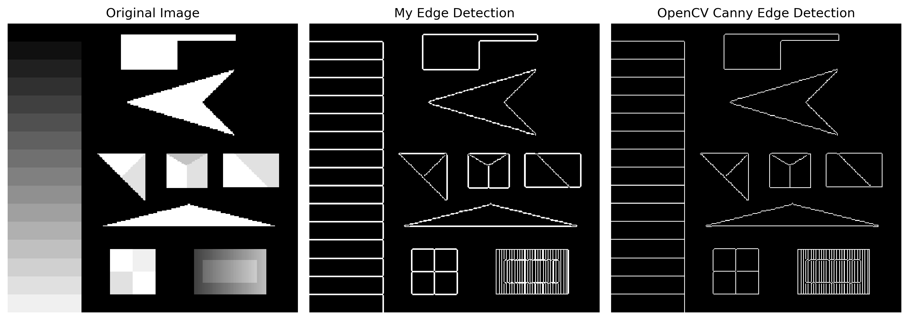
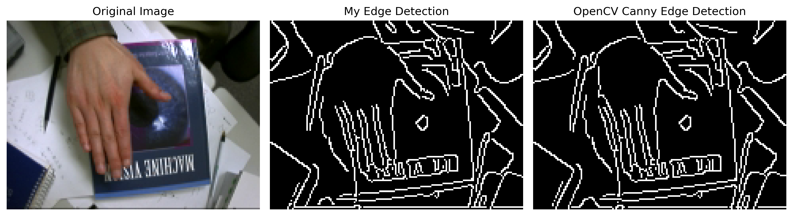
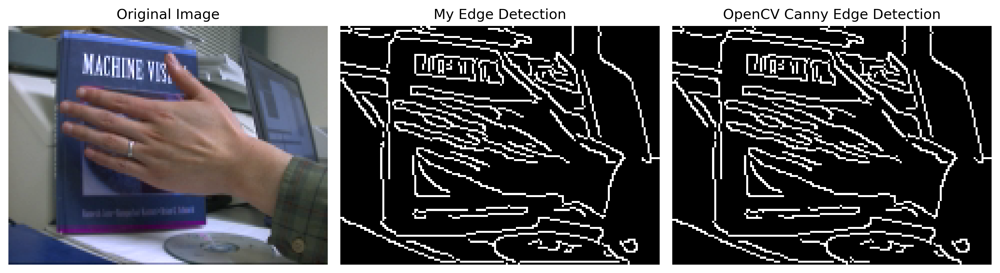

## 4. Tuning Parameters

I ran three experiments on each of the four test images (`lena`, `test1`, `pointer1`, `joy1`):

### 4.1. Varying Kernel Size `N` (σ=1.0, p=0.75)
I found there's no significant change when changing `N`.

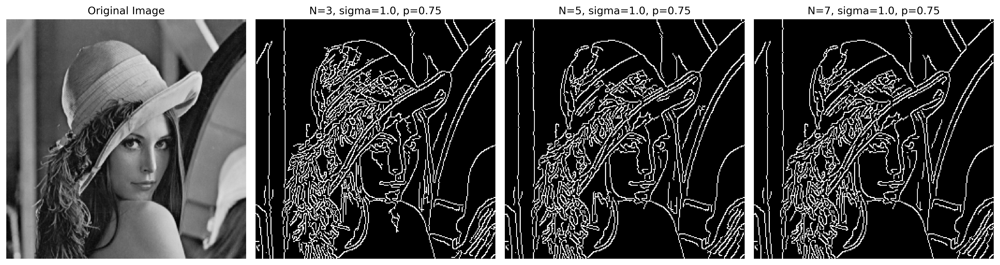
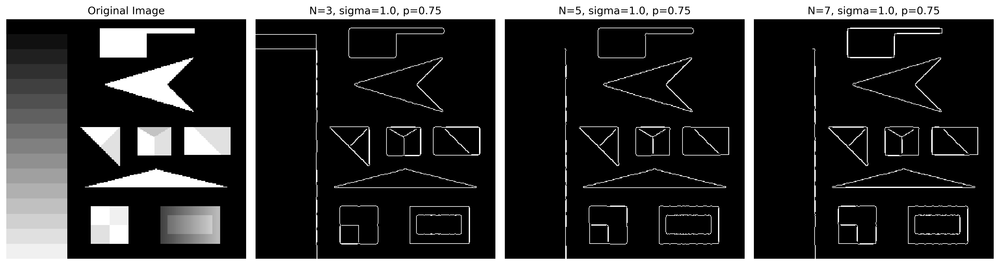
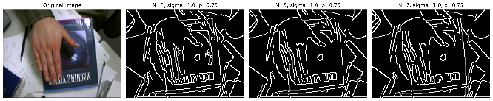
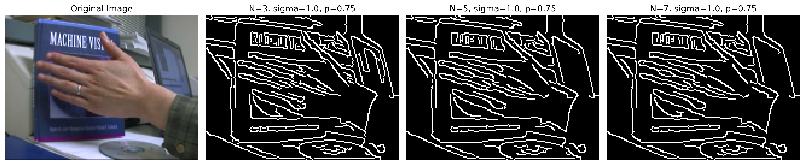

### 4.2. Varying `sigma` (N=5, p=0.75)
I found the image will lose more details as `sigma` grows.

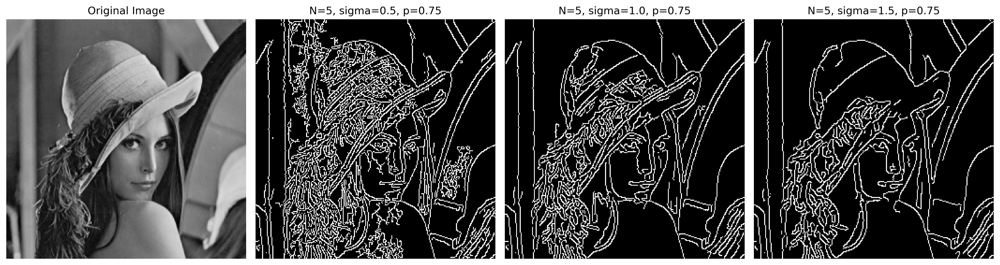

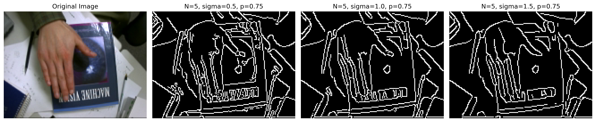
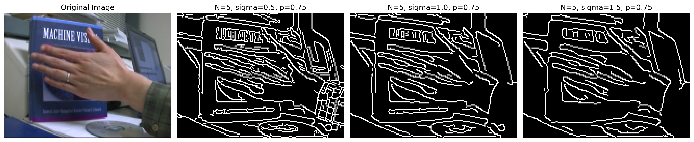

### 4.3. Varying Non-Edge Percentage `percentage_non_edge` (N=5, σ=1.0)
I found the edge would focus on more obvious contours as `percentage_non_edge` grows.

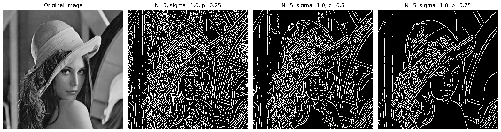
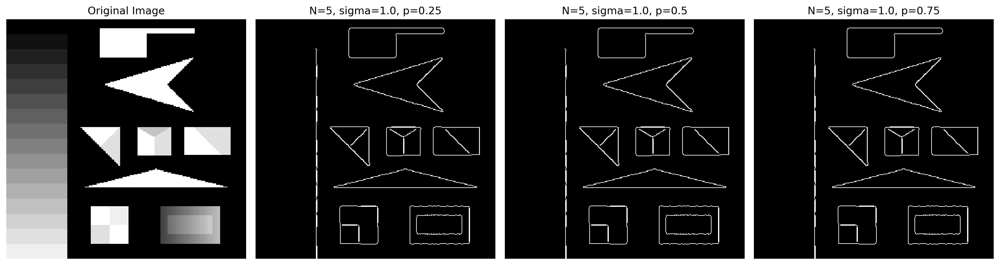
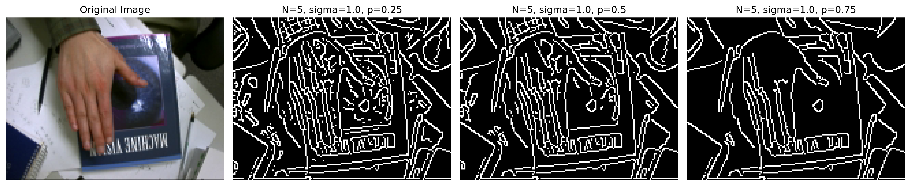
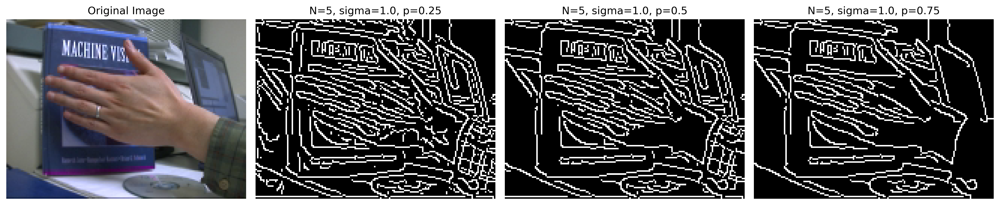
