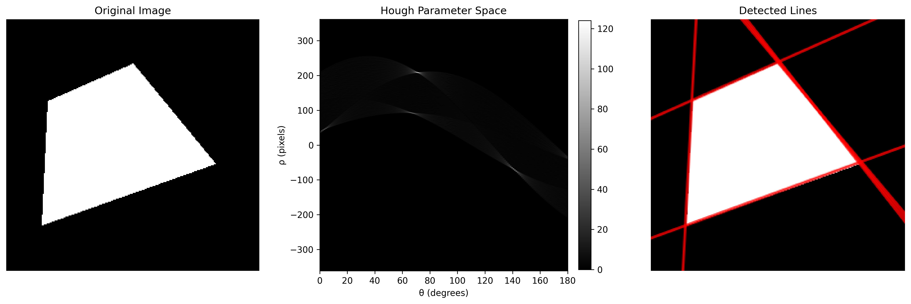
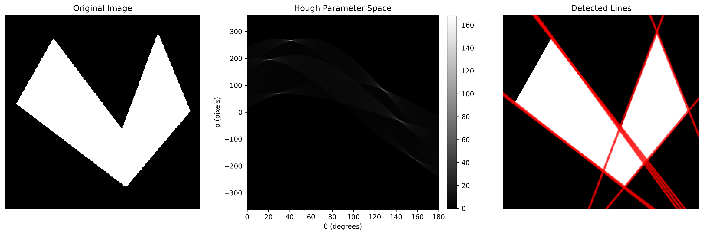
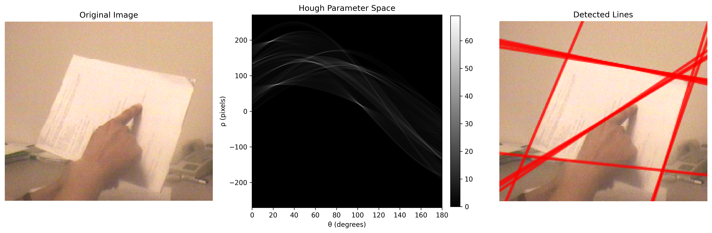
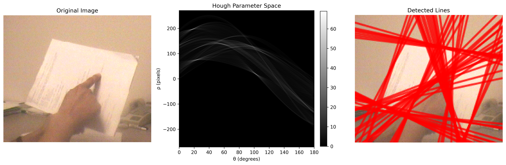
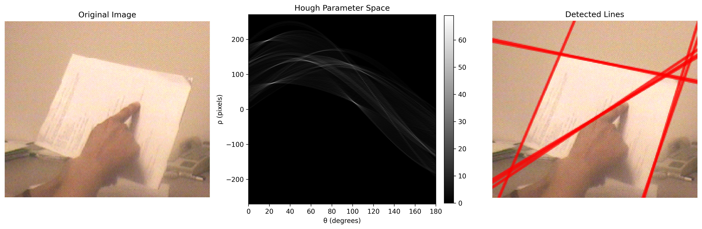
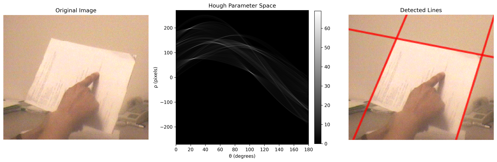

# MP6

## 1. Overview

In `./main.py` I extend the Canny‑plus‑Hough pipeline from MP5 to include full line detection and parameter‑space analysis:

* **Edge detection** Use previous Canny Edge implementation from MP5.
* **Hough parameter space**: Accumulate (rho, theta) votes for each edge pixel.
* **Quantization experiments**: Vary different threshold for detecting significant intersections
* **Peak detection**: Automatic selection of significant intersections in the accumulator.
* **Line overlay**: Draw infinitely long lines clipped to the image on the original RGB input.

## 2. Method

1. **Canny Edge Detection** (from MP5)

   * Gaussian smoothing - gradient magnitude & orientation - NMS - edge linking.

2. **Parameter Space Construction**

   * Define $\theta \in [\theta, \pi)$ in steps of `theta_res` and  $\rho \in [−D, D]$ in steps of `rho_res`.
   * For each edge pixel (x,y) and each theta, compute rho and vote in the accumulator.

3. **Quantization Study**

   * Sweep different levels of threshold for detecting significant intersections.
   * Observe line detection results.

4. **Peak Detection without N**

   * Compute threshold: tau = threshold*max(accumulator).
   * For each accumulator[rho, theta] >= tau, verify it’s the strict local maximum in a k*k neighborhood.

5. **Line Reconstruction & Drawing**

   * Convert each (rho, theta) peak to line normal form.
   * Parametrize endpoints using full image diagonal for “infinite” coverage.

## 3. Results

### 3.1 Visualization
I run on the three supplied images (`test.bmp`, `test2.bmp`, `input.bmp`), and the merged results are as below. Results show clear intersactions in parameter space, and my code successfully draw lines based on these intersections.

### 3.2 Quantization Study
I have tried `threshold= [0.3, 0.6, 0.9]` for `input.bmp`, and the results are as below. Results show that different threshold on the same parameter space can lead to different detect effects for significant intersections. When the threshold grows, fewer intersections are used for drawing lines.

